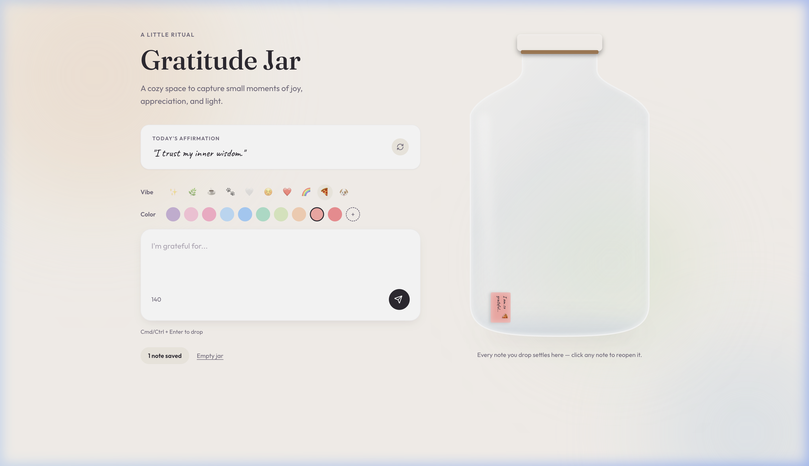
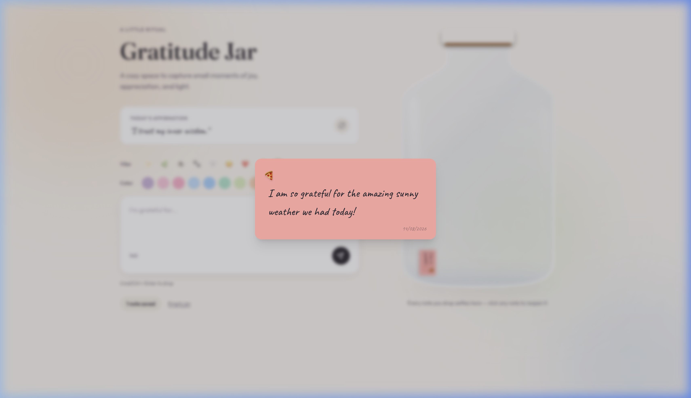

# ✨ Gratitude Jar

> A beautifully crafted, interactive physics-based gratitude journal built for the modern web.

**Live Demo:** https://gratitude-jar-pi.vercel.app/

### The Workflow in Action 🎬
Watch as you write a message, pick a vibe, and drop your note directly into the jar!


---

### Component Gallery 🖼️
<div align="center">
  
  
</div>

<br />

Gratitude Jar is a delightful web application designed to help you capture daily moments of thankfulness. Instead of a standard list, your entries are dropped as physics-enabled "notes" into a beautifully rendered, glassmorphic jar. Watch as your notes physically pile up over time, creating a visual representation of your gratitude!

## 🌟 Features

- **🌈 Physics Engine Integration:** Powered by `matter-js`, every note you drop into the jar has mass, restitution (bounciness), and friction. They tumble, collide, and settle realistically into the custom jar silhouette!
- **✨ Stunning Glassmorphism:** The jar is constructed using a bespoke, mathematically precise SVG path integrated as a CSS `clip-path`. It features realistic glass styling including inner shadows for glass pooling, specular highlights mapping the jar's curve, and a frosted `backdrop-blur` effect.
- **🎨 Pastel Mood Palette:** Choose from 10 distinct beautiful pastel colors mapped to emojis (✨, 🌿, ☕️, 🐾, 🤍, ☺️, ❤️, 🌈, 🍕, 🐶) to categorize your moments.
- **✏️ Handwritten Typography:** Uses the `Kalam` font to give the digital notes a genuine, handwritten physical feel.
- **📱 Responsive & Polished UI:** Fluid layouts, elegant Framer Motion animations (including hover interactions and a custom `shimmer` effect), and robust interactive components.
- **💾 Local Persistence:** Your gratitude notes are automatically saved to your browser's `localStorage` — so your jar is always exactly how you left it.

## 🛠️ Technology Stack

- **React 18** - Core framework
- **Vite** - Lightning fast build tool & dev server
- **Tailwind CSS** - Utility-first styling and custom animations
- **Matter.js** - 2D rigid body physics engine
- **Framer Motion** - Fluid UI transitions and micro-animations
- **Phosphor Icons** - Beautiful, consistent iconography
- **Lucide React** - Additional UI icons

## 🚀 Getting Started

### Prerequisites

Ensure you have [Node.js](https://nodejs.org/) installed on your machine.

### Installation

1. Clone the repository:
   ```bash
   git clone https://github.com/chitrakulkarni2830/gratitude-jar.git
   ```
2. Navigate to the project directory:
   ```bash
   cd gratitude-jar
   ```
3. Install the dependencies:
   ```bash
   npm install
   ```
4. Start the development server:
   ```bash
   npm run dev
   ```
5. Open your browser and navigate to `http://localhost:5173`.

## 🎨 How to Use

1. **Write a Note:** Type what you're grateful for in the input field.
2. **Select a Vibe:** Click on one of the emojis to set the color and mood of your note.
3. **Drop it in:** Hit the "Drop into jar" button. The note will fall from the top of the jar and bounce off other notes!
4. **Revisit:** Click any note inside the jar to open a modal and read it in detail.
5. **Empty Jar:** Want to start fresh? Click the "Empty jar" button at the bottom left (don't worry, it asks for confirmation!).

## 📦 Deployment

**Live Demo:** [https://gratitude-jar-pi.vercel.app/](https://gratitude-jar-pi.vercel.app/)

The app is currently deployed and hosted on Vercel. 

To deploy your own instance, you can build it using:
```bash
npm run build
```
The resulting `dist/` folder can be deployed to Vercel, Netlify, GitHub Pages, or any static hosting service.

## 🤝 Built with ❤️

Designed and developed to bring a little more joy and reflection into the world.
